# Level 1: Phase Classification in Conway's Game of Life

## Overview

Level 1 asks a simple question: Can an unsupervised machine learning algorithm discover the different dynamical phases of Conway's Game of Life just by watching simulations?

We sweep across initial cell densities (ρ₀ from 0.05 to 0.95), run many independent simulations, extract physics-motivated features, and let UMAP + HDBSCAN find natural groupings in the data — all without telling the algorithm anything about what we expect to find.

## What Level 1 Does

### The Experimental Protocol

1. SIMULATE 950 runs across 19 densities
2. EXTRACT 30 features per simulation
3. CLUSTER with UMAP + HDBSCAN
4. INTERPRET what makes each phase unique

**Simulation parameters:**

- **Grid:** 100×100 cells (toroidal/periodic boundaries)
- **Rule:** Conway's Game of Life (B3/S23)
- **Time:** 500 steps per simulation
- **Initial densities:** 19 values from 0.05 to 0.95 (steps of 0.05)
- **Replicates:** 50 random initial configurations per density
- **Total simulations:** 950

### What We Track

For each simulation, we record:

- The **density time-series** ρ(t) at every step
- The **final grid configuration**
- When (or if) the system settles into a fixed point or cycle
- The penultimate state (to measure activity)

### Density Traces

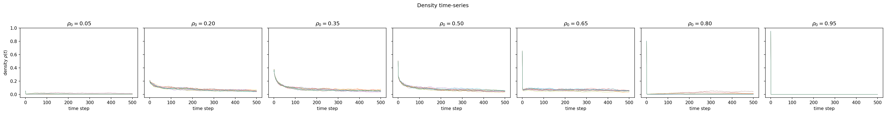

### Grid Snapshots

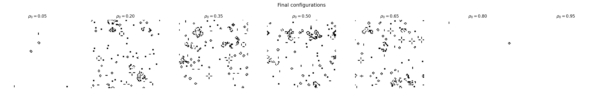

## Feature Engineering

Raw simulation outputs are condensed into a **30-dimensional feature vector** per run. These features capture different physical aspects of the dynamics:

### Density Statistics (7 features)

| Feature             | What it measures                                             |
| ------------------- | ------------------------------------------------------------ |
| `rho_final_mean`    | Average population in steady state                           |
| `rho_final_std`     | Fluctuations in steady state                                 |
| `rho_final_min/max` | Extremes of density                                          |
| `rho_range`         | Amplitude of density fluctuations                            |
| `rho_drop`          | How much density decreased from start                        |
| `rho_slope`         | Linear trend in steady state (should be ~0 if truly settled) |

### Spatial Structure (8 features)

| Feature                     | What it measures                                                                                               |
| --------------------------- | -------------------------------------------------------------------------------------------------------------- |
| `n_clusters`                | Number of connected components (clusters of live cells)                                                        |
| `mean/max/std_cluster_size` | Statistics of component sizes                                                                                  |
| `acf_r1, r2, r5, r10`       | Spatial autocorrelation at different distances — how correlated are cells that are 1, 2, 5, or 10 cells apart? |

### Fourier Spectrum (4 features)

| Feature               | What it measures                                         |
| --------------------- | -------------------------------------------------------- |
| `fourier_k_mean`      | Average spatial frequency (characteristic pattern scale) |
| `fourier_k_var`       | Spread of spatial frequencies (broadband vs. narrow)     |
| `fourier_k_peak`      | Dominant spatial frequency                               |
| `fourier_total_power` | Overall spatial variability                              |

### Temporal Dynamics (3 features)

| Feature             | What it measures                             |
| ------------------- | -------------------------------------------- |
| `settled`           | Did the system reach a fixed point or cycle? |
| `settling_time`     | When did it settle?                          |
| `settling_fraction` | settling_time / total steps                  |

### Activity & Entropy (5 features)

| Feature            | What it measures                                                                          |
| ------------------ | ----------------------------------------------------------------------------------------- |
| `activity`         | Fraction of cells changing between last two steps (distinguishes static from oscillating) |
| `spatial_entropy`  | Disorder in 2×2 block patterns (0 = uniform, 1 = random)                                  |
| `temporal_entropy` | Disorder in density time-series (0 = constant, 1 = unpredictable)                         |

### Period Features (4 features)

| Feature       | What it measures                         |
| ------------- | ---------------------------------------- |
| `period`      | Length of detected cycle (0 = aperiodic) |
| `is_static`   | Period = 1 (still life)                  |
| `is_periodic` | 1 < period ≤ 50                          |
| `is_chaotic`  | Period = 0 and never settled             |

## The Machine Learning Pipeline

Here's how we go from features to discovered phases:

### Step 1: Separate Extinct Configurations

Configurations with `rho_final_mean = 0` (completely dead grids) are given a special label `-2` and removed from the main clustering. Why? Dead grids all look identical spatially, but vary in _how fast_ they died — clustering them would create artificial subdivisions based on settling time, not physics.

### Step 2: Exclude the Control Parameter

We remove `density_init` from the features used for clustering. Including it would bias the algorithm to group by initial condition rather than emergent behavior.

### Step 3: Standardise

Apply z-score normalisation so all features have mean 0 and variance 1 (prevents features with large numerical ranges from dominating).

### Step 4: UMAP Dimensionality Reduction

Project the 29-dimensional feature space down to 2 dimensions using UMAP. This preserves local structure while creating a visualizable embedding.

**UMAP parameters:**

- `n_neighbors = 30` (balance local vs global structure)
- `min_dist = 0.1` (how tightly to pack points)
- `metric = 'euclidean'`

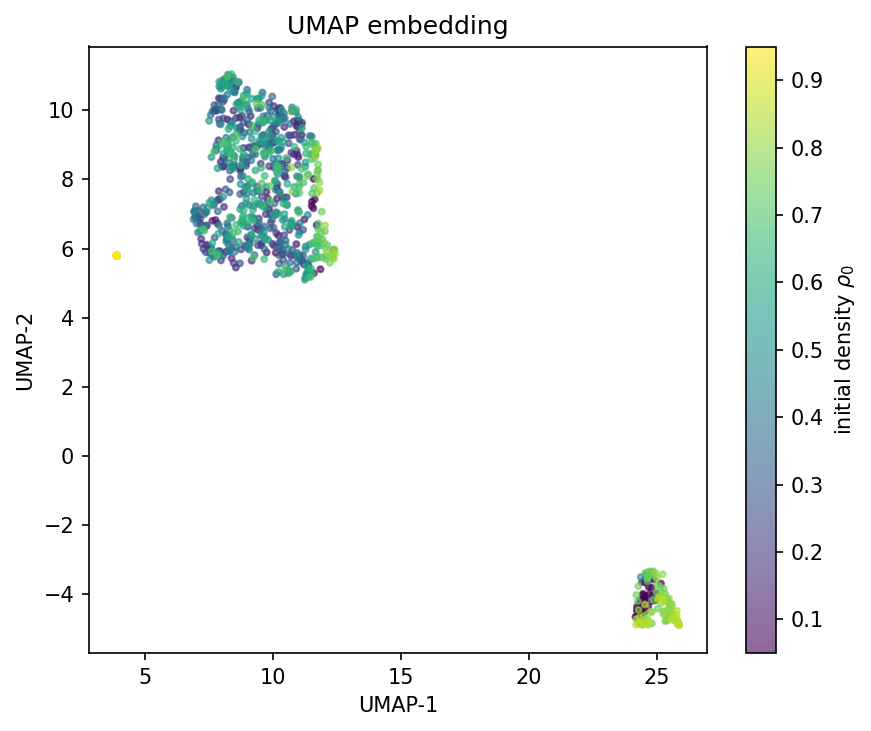

### Step 5: HDBSCAN Clustering

Find clusters in the 2D UMAP embedding without specifying the number of clusters beforehand.

**HDBSCAN parameters:**

- `min_cluster_size = 15`
- `min_samples = 5`
- `cluster_selection_method = 'eom'`

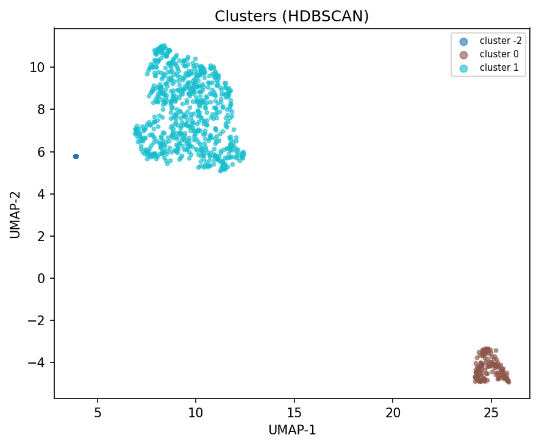

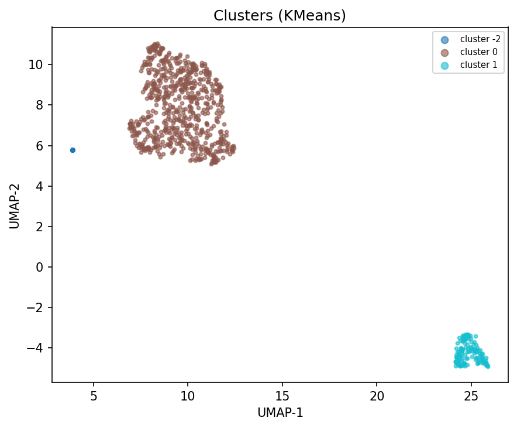

### Step 6: Feature Importance

Calculate η² (eta-squared) for each feature — this measures how much of the feature's variance is explained by cluster membership. High η² means the feature strongly discriminates between phases.

## Results: The Discovered Phases

The pipeline automatically recovered **three distinct dynamical phases**:

### Phase 1: Extinct (Label -2)

| Property          | Value                                                                                                                                   |
| ----------------- | --------------------------------------------------------------------------------------------------------------------------------------- |
| **Count**         | 123 simulations (12.9%)                                                                                                                 |
| **ρ₀ range**      | 0.85–0.95                                                                                                                               |
| **ρ_final**       | 0 exactly                                                                                                                               |
| **Settling time** | 2.8 ± 0.7 steps                                                                                                                         |
| **Description**   | The grid dies completely within a few steps. On a 100×100 grid, extinction occurs only at high density — overcrowding kills everything. |

### Phase 2: Sparse Static (Label 0)

| Property          | Value                                                                                                                                                                            |
| ----------------- | -------------------------------------------------------------------------------------------------------------------------------------------------------------------------------- |
| **Count**         | 143 simulations (15.1%)                                                                                                                                                          |
| **ρ₀ range**      | 0.05–0.85                                                                                                                                                                        |
| **ρ_final**       | 0.006 ± 0.007                                                                                                                                                                    |
| **n_clusters**    | 27.0 ± 33.1                                                                                                                                                                      |
| **Settled**       | Yes (all configurations settled)                                                                                                                                                 |
| **Settling time** | 111.0 ± 154.9 steps                                                                                                                                                              |
| **Description**   | The system collapses to a few isolated still-lifes — 2×2 blocks, beehives, boats. These are stable, never-changing patterns. Looks like a sparse graveyard of frozen structures. |

### Phase 3: Active / Chaotic (Label 1)

| Property        | Value                                                                                                                        |
| --------------- | ---------------------------------------------------------------------------------------------------------------------------- |
| **Count**       | 684 simulations (72.0%)                                                                                                      |
| **ρ₀ range**    | 0.05–0.80                                                                                                                    |
| **ρ_final**     | 0.051 ± 0.014                                                                                                                |
| **n_clusters**  | 192.8 ± 49.8                                                                                                                 |
| **Settled**     | No (none settled within 500 steps)                                                                                           |
| **Period**      | 0 (aperiodic, never settles)                                                                                                 |
| **Description** | Rich, persistent dynamics with gliders, oscillators, and complex interactions. The system never stabilises within 500 steps. |

### The Phase Diagram

The transition between phases is sharp:

| ρ₀ range  | Dominant Phase                  |
| --------- | ------------------------------- |
| 0.05      | Mixed: sparse static and active |
| 0.10–0.80 | **Active / Chaotic** (dominant) |
| 0.85–0.95 | **Extinct** (100%)              |

This reveals a **sharp phase boundary** at ρ₀ ≈ 0.85 where overcrowding kills everything. At low densities the 100×100 grid is large enough that even sparse initialisations sustain complex dynamics — extinction at low ρ₀ is absent (unlike on smaller grids).

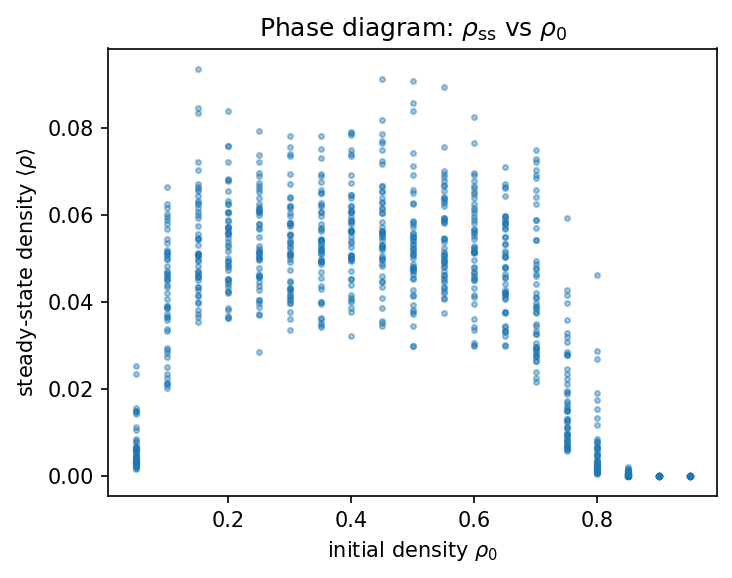

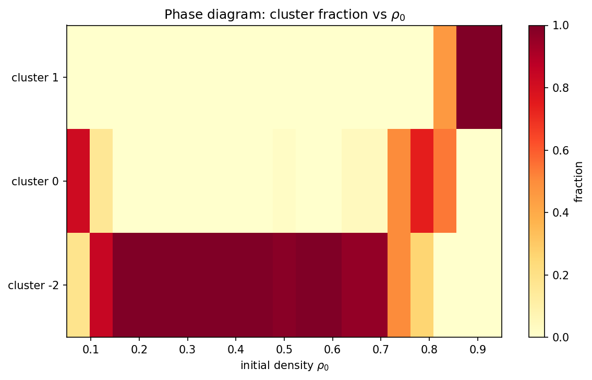

### What Features Best Discriminate the Phases?

The top discriminators (η² scores) reveal what _really_ distinguishes the phases:

| Rank | Feature          | η²    | What this tells us                                                                                              |
| ---- | ---------------- | ----- | --------------------------------------------------------------------------------------------------------------- |
| 1    | `is_chaotic`     | 1.000 | **Perfect separator** — the active phase never settles; the sparse static phase always does                     |
| 2    | `settled`        | 1.000 | **Perfect separator** — equivalent binary flag                                                                  |
| 3    | `fourier_k_var`  | 0.969 | **Spectral width** — active phases have broad, multi-scale structure; static phases have narrow, peaked spectra |
| 4    | `acf_r1`         | 0.934 | **Short-range correlations** — how cells cluster locally                                                        |
| 5    | `fourier_k_mean` | 0.929 | **Characteristic scale** — different phases have different dominant pattern sizes                               |

**Key insight:** The temporal settling behaviour (`is_chaotic`, `settled`) perfectly separates the two alive phases, with η² = 1.0. Fourier and spatial correlation features are the next-best discriminators — how cells are arranged matters more than how many are alive.

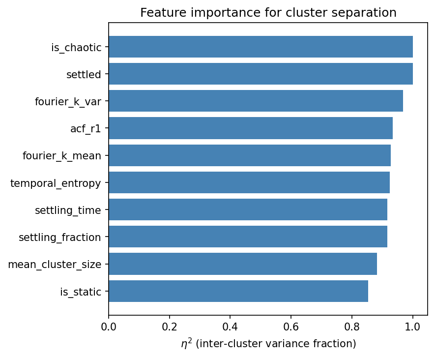

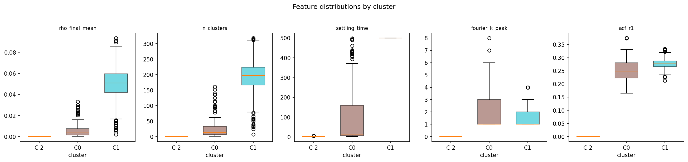

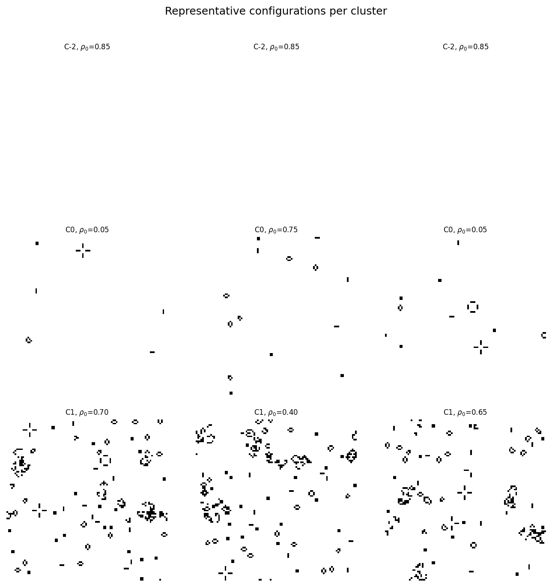

### Cluster Quality

- **Silhouette score: 0.878** (very high — phases are well separated)
- **HDBSCAN found 2 clusters** in the alive subset, 0 noise points (plus the pre-separated extinct class = 3 total phases)
- **k-means optimal k = 2** for alive configurations, confirming the two-phase structure

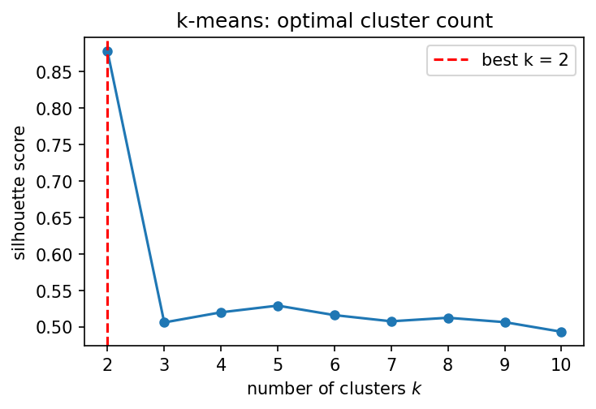
