# Level 3 — Rule-Space Phase Classification

## Overview

Level 3 extends the analysis beyond Conway's Game of Life to the **full space of 2-state outer-totalistic cellular automata**. There are $2^9 \times 2^9 = 262{,}144$ such rules (each defined by which of the 9 possible neighbour counts cause birth and which allow survival). By sampling rules, characterising each with a 66-dimensional feature vector (including a **damage spreading rate** analogous to a Lyapunov exponent), and running UMAP + HDBSCAN, the pipeline **recovers Wolfram dynamical classes** — dead/frozen, chaotic, and complex/periodic — entirely from unsupervised ML on raw simulation data.

## Background

### Langton's $\lambda$ Parameter

Each rule's complexity is summarised by $\lambda = (|B| + |S|) / 18$, where $|B|$ and $|S|$ are the number of birth and survival counts. The order–chaos transition occurs near $\lambda \approx 0.5$.

### Wolfram's Four Dynamical Classes

| Class | Name                | Behaviour                                                        |
| ----- | ------------------- | ---------------------------------------------------------------- |
| I     | Dead / Frozen       | System collapses to uniform state ($\rho \to 0$ or $\rho \to 1$) |
| II    | Ordered / Static    | Simple periodic structures, low damage spreading                 |
| III   | Chaotic / Aperiodic | Never settles, high damage spreading, high entropy               |
| IV    | Complex / Periodic  | Long-period oscillations, edge of chaos                          |

## Method

### 1. Sample Rules

Rules are sampled from the 262,144-rule space using one of three strategies:

| Strategy     | Description                                                                                                       |
| ------------ | ----------------------------------------------------------------------------------------------------------------- |
| `critical`   | 60% of rules from $\lambda \in [0.3, 0.7]$ (where the order–chaos transition lies), 40% from flanks. **Default.** |
| `stratified` | Uniform coverage across $\lambda$ bins                                                                            |
| `random`     | Uniform random from the full rule space                                                                           |

Critical-region-focused sampling concentrates computational effort where the most interesting physics occurs.

### 2. Characterise Each Rule

Each rule is characterised by running an **ensemble of simulations** and measuring **damage spreading**:

- **Ensemble**: 5 replicates × 3 initial densities ($\rho_0 \in \{0.2, 0.4, 0.6\}$) = 15 simulations per rule.
- **Feature extraction**: 30 physics features per simulation (same as Level 1), averaged and std-computed across the ensemble.
- **Damage spreading**: 3 paired simulations where two identical grids differ by a single-cell flip. The Hamming distance divergence yields:
  - `damage_spreading_rate` — average exponential growth rate (CA analogue of a Lyapunov exponent)
  - `damage_saturation` — asymptotic Hamming distance (fraction of grid that ultimately differs)

This produces a **~66-dimensional feature vector** per rule (30 means + 30 stds + damage + $\lambda$ + metadata).

### 3. Cluster

1. **Exclude meta-features** from clustering: `rule_id`, `langton_lambda`, `n_birth`, `n_survive` (these are rule parameters, not emergent observables).
2. **UMAP + HDBSCAN** (leaf cluster selection for finer granularity) on the remaining features.
3. **k-means sweep** for comparison.
4. If HDBSCAN finds ≥3 clusters, its labels are used; otherwise, k-means labels are used.

### 4. Assign Wolfram Regimes

ML clusters are mapped to Wolfram classes using physical signatures:

```
if ρ_final < 0.05                      → Class I  (dead)
if ρ_final > 0.9 and damage < 0.05     → Class I  (frozen)
if period > 2                           → Class IV (complex/periodic)
if damage < 0.08 and period ≥ 1        → Class II (ordered/static)
if damage > 0.12 and period = 0        → Class III (chaotic)
if damage > 0.08                        → Class III (weakly chaotic)
else                                    → Class II (weak order)
```

### 5. Interpret & Visualise

- Feature importance ($\eta^2$) across the HDBSCAN clusters.
- Per-class summary bar charts of key observables.
- Scatter plots of $\lambda$ vs each observable (9 plots).
- Publication-quality summary panel (2×3) and Wolfram regimes panel (2×2).

## Results (111 Rules, 50 × 50, 300 Steps)

200 rules were requested with critical sampling; 111 unique rules were obtained after deduplication.

### Wolfram Regimes Recovered

| Wolfram Class               | n   | Physical Signature                                              |
| --------------------------- | --- | --------------------------------------------------------------- |
| **I (dead / frozen)**       | 1   | $\rho \to 0$, zero damage spreading                             |
| **III (chaotic)**           | 63  | Aperiodic, high damage spreading, high spatial entropy          |
| **IV (complex / periodic)** | 21  | Long-period oscillations, low–moderate damage, moderate entropy |

Class II (ordered/static) was not observed in this sample — the critical-region sampling strategy concentrates on $\lambda \in [0.3, 0.7]$, where most rules exhibit either chaotic or complex dynamics rather than simple ordered behaviour.

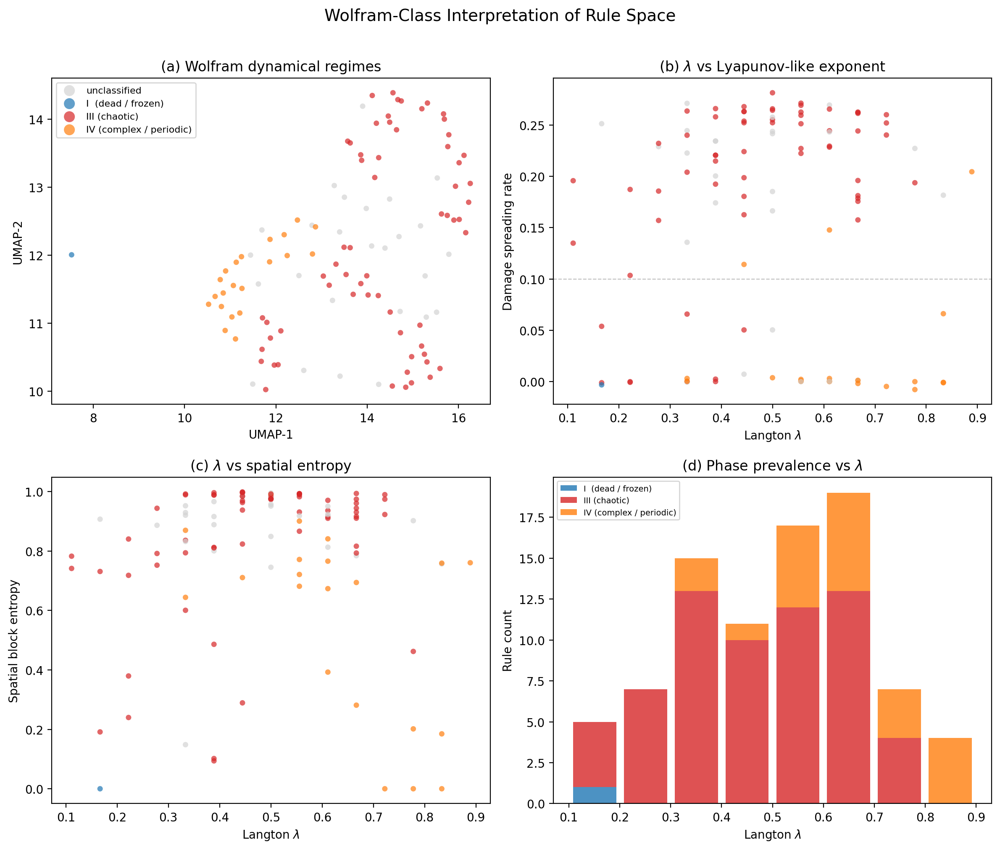

### Clustering Structure

- **HDBSCAN (leaf)** found **8 fine-grained clusters** (+ 1 extinct), which were then mapped to Wolfram regimes.
- **k-means best k = 5** (silhouette = 0.485).
- HDBSCAN labels were used since the number of clusters exceeded the threshold (≥ 3).

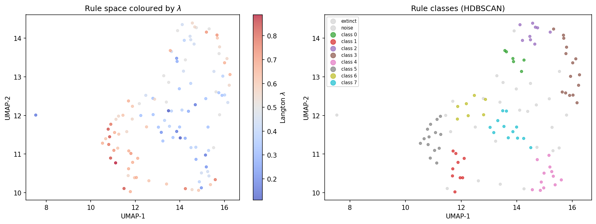

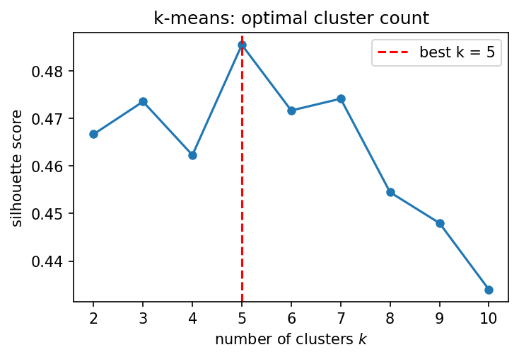

### HDBSCAN Class Summary

| Class | n   | $\lambda$     | Damage rate | Spatial entropy | Period | $\rho_\text{final}$ | Example rules                          |
| ----- | --- | ------------- | ----------- | --------------- | ------ | ------------------- | -------------------------------------- |
| 0     | 6   | 0.426 ± 0.146 | 0.221       | 0.945           | 0.000  | 0.388               | B02467/S158, B157/S12347, B02568/S1257 |
| 1     | 9   | 0.654 ± 0.044 | 0.222       | 0.890           | 0.000  | 0.673               | B04568/S02567, B012467/S12456          |
| 2     | 9   | 0.500 ± 0.094 | 0.251       | 0.993           | 0.000  | 0.523               | B01345/S15, B24578/S156, B0348/S0345   |
| 3     | 15  | 0.515 ± 0.117 | 0.250       | 0.983           | 0.000  | 0.514               | B36/S2348, B124/S256, B237/S1358       |
| 4     | 12  | 0.431 ± 0.179 | 0.139       | 0.665           | 0.678  | 0.456               | B0234/S023, B1238/S0125, B013478/S13   |
| 5     | 14  | 0.710 ± 0.109 | 0.029       | 0.437           | 2.205  | 0.873               | B0236/S134567, B0146/S124567           |
| 6     | 7   | 0.476 ± 0.102 | 0.018       | 0.819           | 12.276 | 0.460               | B047/S013, B4/S12345, B014/S12347      |
| 7     | 12  | 0.287 ± 0.104 | 0.119       | 0.598           | 0.967  | 0.178               | B18/S0158, B6/S02348, B18/S0478        |

Classes 0–3 are chaotic (high damage rate, zero period). Classes 5–6 are complex/periodic (long periods, low damage rate). Classes 4 and 7 are intermediate.

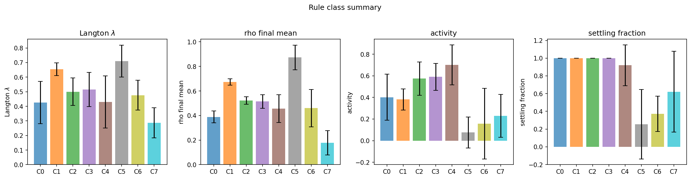

### Top Discriminating Features

| Rank | Feature             | $\eta^2$ | Interpretation               |
| ---- | ------------------- | -------- | ---------------------------- |
| 1    | `rho_final_min`     | 0.723    | Minimum steady-state density |
| 2    | `rho_drop`          | 0.721    | Density drop from initial    |
| 3    | `rho_final_mean`    | 0.720    | Steady-state population      |
| 4    | `max_cluster_size`  | 0.715    | Largest connected component  |
| 5    | `mean_cluster_size` | 0.672    | Mean connected component     |

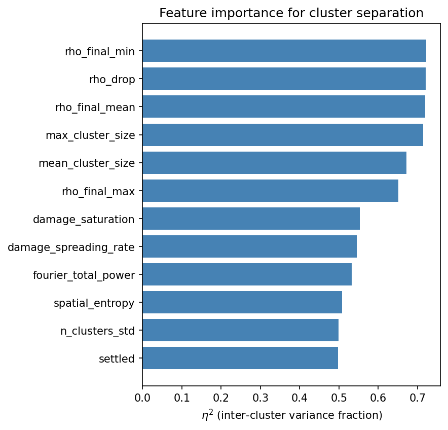

### Key Physics Findings

1. **Chaotic dynamics dominate the critical region**: 63 of 85 non-extinct rules in the $\lambda \in [0.3, 0.7]$ range are classified as Wolfram Class III (chaotic). This is consistent with the theoretical expectation that most rules near $\lambda \approx 0.5$ exhibit complex, aperiodic dynamics.

2. **Class IV at the edge of chaos**: Complex/periodic rules (21 rules) exhibit long-period oscillations (mean period $\approx 2$–$12$) with low damage spreading rates, consistent with Langton's "edge of chaos" hypothesis.

3. **Density features are the strongest discriminators**: Unlike Level 1 where Fourier/temporal features dominated, the rule-space classification is primarily driven by steady-state density statistics ($\rho_\text{final}$, density drop, cluster sizes). This makes physical sense — across the diverse rule space, the most fundamental axis of variation is how much of the grid survives.

4. **Damage spreading rate** remains the most physically informative single feature for distinguishing ordered from chaotic dynamics — it serves as a CA analogue of a Lyapunov exponent.

5. **The classification is entirely unsupervised** — no labelled training data was used. The ML pipeline discovers physically meaningful structure from raw simulation output.

### λ vs Observable Scatter Plots

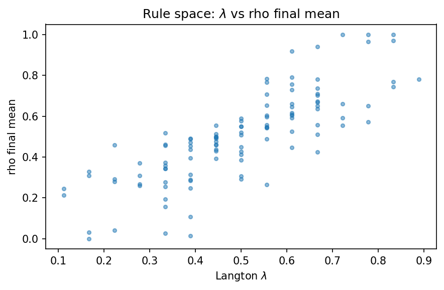

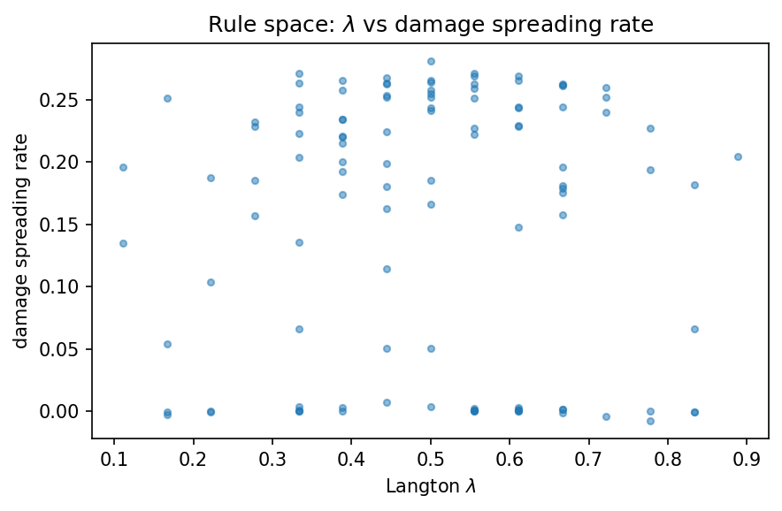

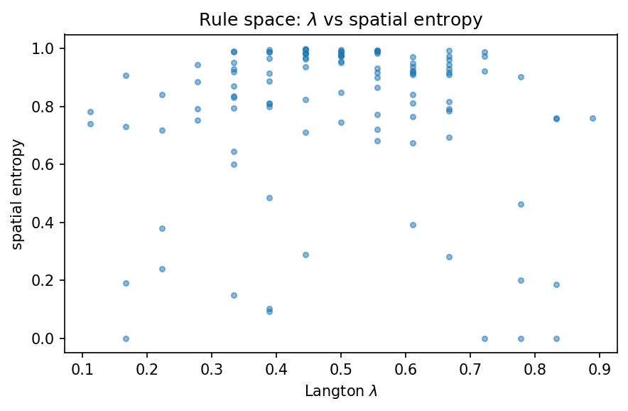

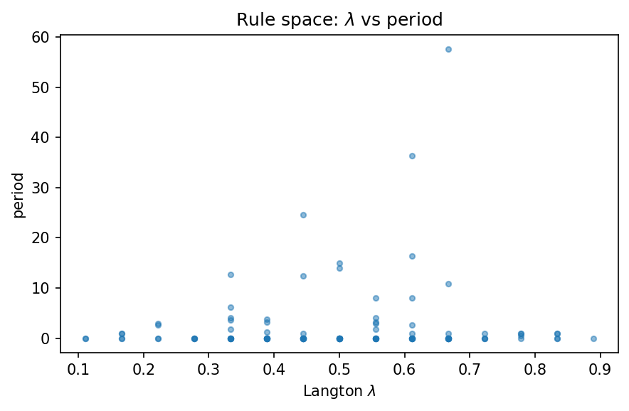

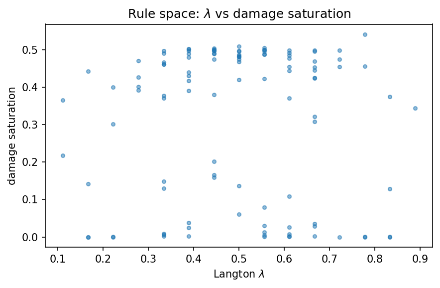

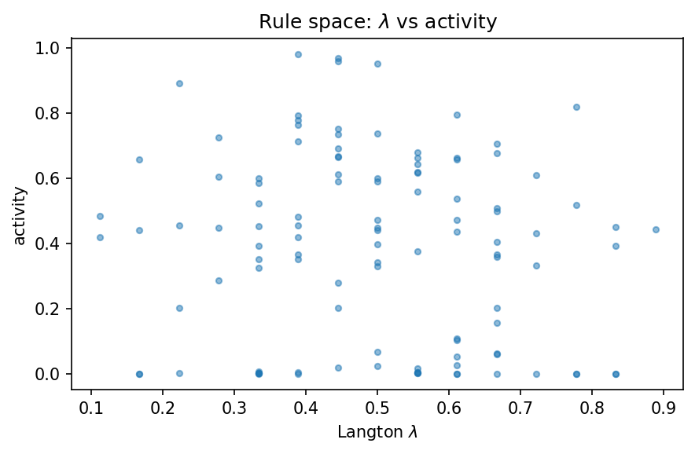

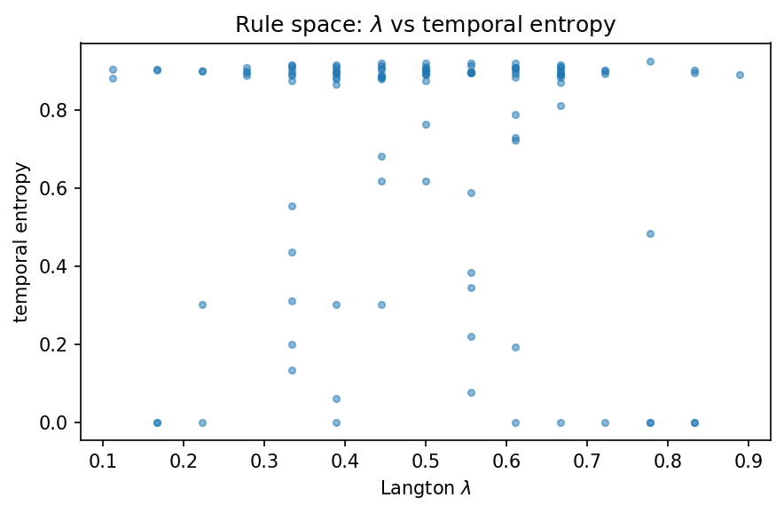

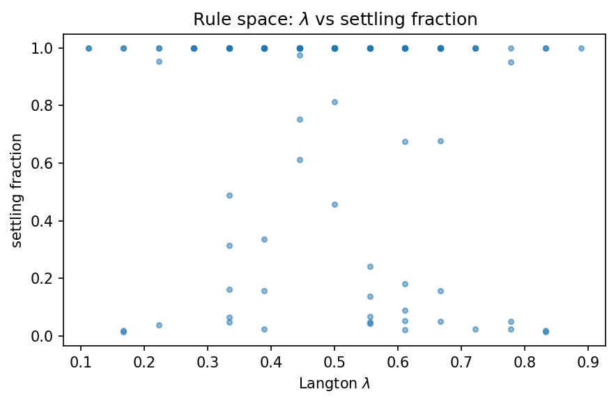

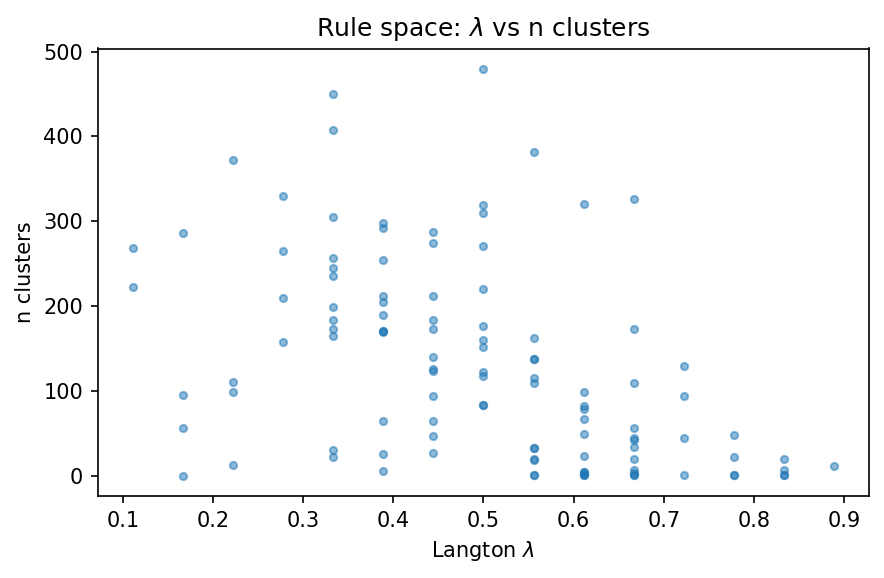
