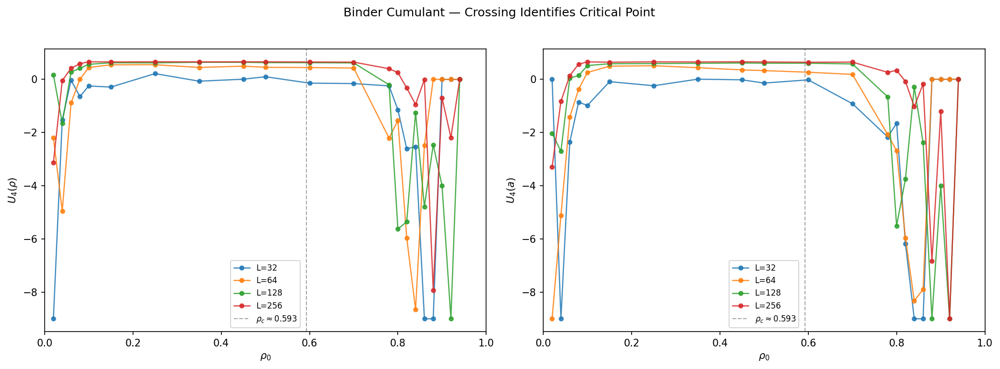
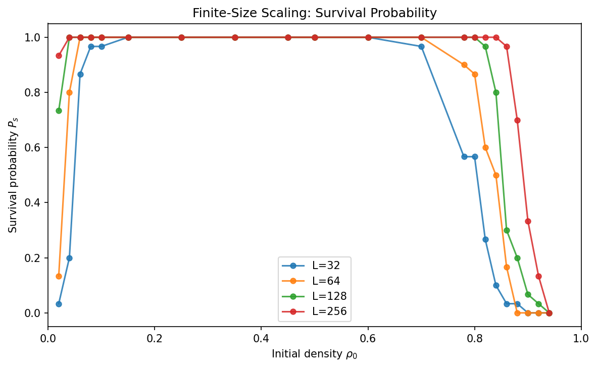
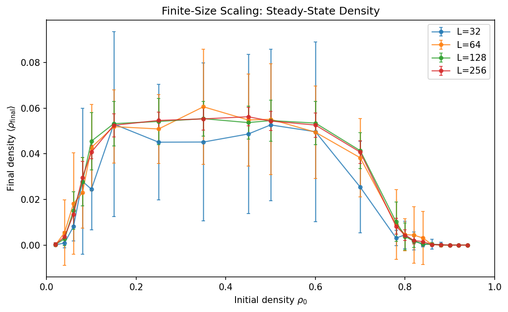
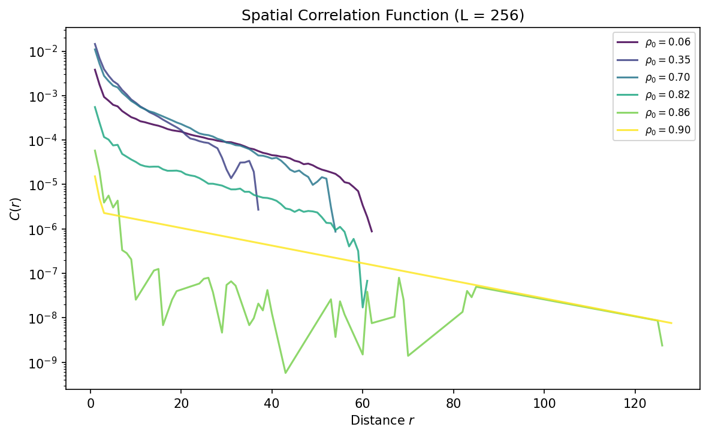
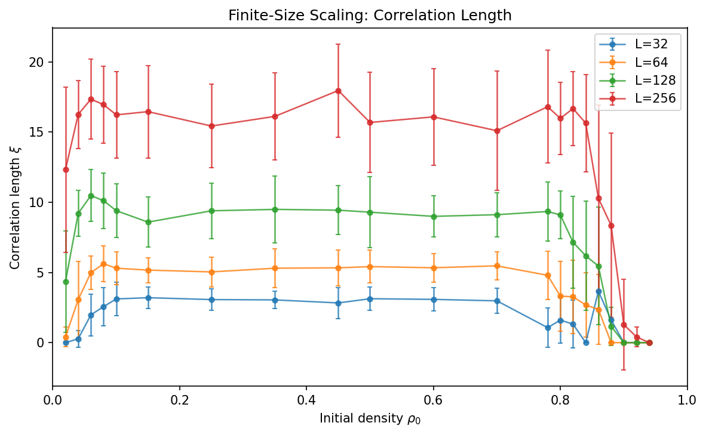
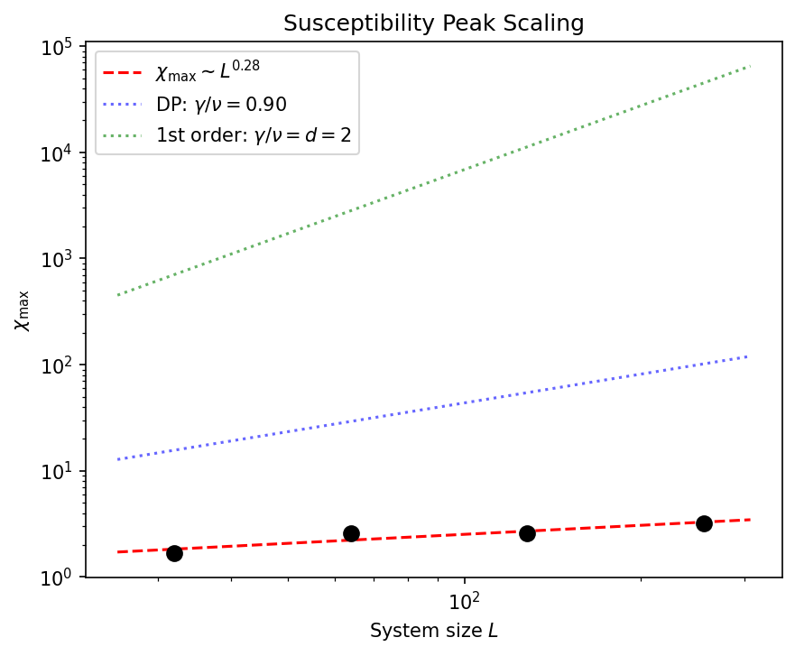
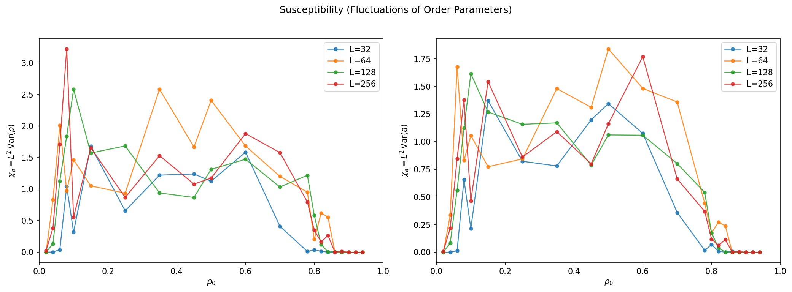
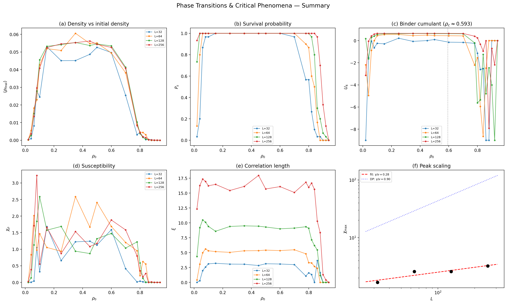

# Level 4 — Phase Transitions & Critical Phenomena

## Overview

Level 4 asks the central question: **Do the ML-discovered phases from Level 1 correspond to genuine thermodynamic phase transitions?** In equilibrium statistical mechanics, a "phase" has a precise meaning — a sharp transition in the thermodynamic limit ($L \to \infty$), a diverging correlation length, and universal critical exponents. This level tests these criteria by performing **finite-size scaling** on Conway's Game of Life across system sizes $L = 32, 64, 128, 256$.

The results are striking: the extinction transition is **first-order** (not continuous), the active phase **expands** with system size, and the correlation length **scales with $L$** — indicating the active phase is intrinsically scale-free.

## Background

### What Makes a Phase Transition "Real"?

In equilibrium statistical mechanics, a phase transition requires:

1. A **sharp discontinuity** (or divergence) in the thermodynamic limit
2. An **order parameter** that distinguishes the phases
3. A **diverging correlation length** at the critical point
4. **Universal critical exponents** that depend only on dimensionality and symmetry

### Finite-Size Scaling

On a finite lattice of side $L$, true singularities are rounded. Finite-size scaling (FSS) exploits this: by measuring observables at several system sizes and examining how they scale with $L$, we can determine whether a transition exists and what type it is.

Key diagnostics:

| Observable                            | Continuous (2nd-order)                     | First-order                        |
| ------------------------------------- | ------------------------------------------ | ---------------------------------- |
| **Binder cumulant** $U_4$             | Curves for different $L$ cross at $\rho_c$ | Deep minimum that deepens as $L^d$ |
| **Susceptibility peak** $\chi_{\max}$ | Grows as $L^{\gamma/\nu}$                  | Grows as $L^d$                     |
| **Order parameter at $\rho_c$**       | Decays as $L^{-\beta/\nu}$                 | Remains finite                     |
| **Transition location**               | Converges to fixed $\rho_c$                | May drift with $L$                 |

### Directed Percolation Universality

The Janssen-Grassberger conjecture states that absorbing-state transitions with a scalar order parameter, short-range interactions, and no special symmetries belong to the **directed percolation (DP)** universality class. In 2D:

$$\beta_\text{DP} = 0.584, \quad \nu_{\perp,\text{DP}} = 0.734, \quad \gamma/\nu_\text{DP} = 0.901$$

## Method

### 1. Finite-Size Scaling Sweep

Simulations are run across **4 system sizes** and **21 initial densities**, with dense sampling near the extinction transition:

| Parameter                 | Value                                                                       |
| ------------------------- | --------------------------------------------------------------------------- |
| Grid sizes $L$            | 32, 64, 128, 256                                                            |
| Initial densities         | 21 values in $[0.02, 0.94]$, fine resolution near $\rho_0 \in [0.78, 0.94]$ |
| Samples per $(L, \rho_0)$ | 30                                                                          |
| Time steps                | 500                                                                         |
| Rule                      | B3/S23 (Conway's Game of Life)                                              |
| Boundary                  | Periodic (toroidal)                                                         |
| **Total simulations**     | **2,520**                                                                   |

### 2. Observables

For each simulation, we collect:

| Observable                                                                     | Definition                                                      | Purpose                           |
| ------------------------------------------------------------------------------ | --------------------------------------------------------------- | --------------------------------- |
| **Final density** $\rho_\text{final}$                                          | Fraction of alive cells at $t = 500$                            | Order parameter (candidate)       |
| **Activity** $a$                                                               | Fraction of cells changing per step, averaged over steady state | Order parameter (alternative)     |
| **Survival** $P_s$                                                             | Fraction of runs with $\rho_\text{final} > 0$                   | Sharpest transition diagnostic    |
| **Susceptibility** $\chi = L^2 \operatorname{Var}(\rho)$                       | Scaled fluctuations across samples                              | Peaks at transitions              |
| **Binder cumulant** $U_4 = 1 - \langle m^4 \rangle / (3\langle m^2 \rangle^2)$ | Fourth-order cumulant ratio                                     | Distinguishes 1st- from 2nd-order |
| **Correlation function** $C(r)$                                                | Connected two-point function via FFT                            | Spatial structure                 |
| **Correlation length** $\xi$                                                   | Second-moment definition from $C(r)$                            | Characteristic length scale       |

### 3. Correlation Function via FFT

The spatial correlation is computed using the Wiener-Khinchin theorem on the periodic grid:

$$C(\mathbf{r}) = \langle \delta s(\mathbf{x}) \, \delta s(\mathbf{x} + \mathbf{r}) \rangle, \quad \delta s = s - \langle s \rangle$$

$$C(\mathbf{r}) = \mathcal{F}^{-1}\!\bigl[|\mathcal{F}[\delta s]|^2\bigr] / N$$

then radially averaged to obtain $C(r)$. The correlation length is extracted via the second-moment definition:

$$\xi^2 = \frac{\sum_r r^2 C(r)}{\sum_r C(r)}$$

## Results (L = 32, 64, 128, 256 — B3/S23)

### The Extinction Transition Is First-Order

The Binder cumulant provides the clearest diagnostic. For a **second-order** (continuous) transition, $U_4$ curves for different $L$ should cross at a single fixed point $\rho_c$. Instead, we observe:

- **Deep minima** in $U_4$ near both transitions, growing deeper with increasing $L$
- **No clean crossing point** — the minima shift with system size
- Both features are hallmarks of a **first-order (discontinuous) transition**

The order parameter $\rho_\text{final}$ jumps discontinuously from $\sim 0.04$ (active phase) to exactly 0 (extinct), confirming the first-order nature. There is no intermediate regime where $\rho_\text{final}$ continuously approaches zero.

### The Active Phase Expands with System Size

The survival probability $P_s$ reveals that **both** transitions (low-density and high-density extinction) shift outward as $L$ increases:

| $L$ | $\rho_0$ at $P_s = 0.5$ (high-density) | $\rho_0$ at $P_s = 0.5$ (low-density) |
| --- | -------------------------------------- | ------------------------------------- |
| 32  | $\sim 0.80$                            | $\sim 0.03$                           |
| 64  | $\sim 0.84$                            | $< 0.02$                              |
| 128 | $\sim 0.85$                            | $< 0.02$                              |
| 256 | $\sim 0.89$                            | $< 0.02$                              |

As $L \to \infty$, the active phase appears to fill the entire interval $(0, 1)$. This is because:

- **High density**: on larger grids, there are more opportunities for a surviving nucleus to form amidst the initial overcrowding. The probability of having at least one region sparse enough to seed sustained activity grows with system size.
- **Low density**: on larger grids, even a few initial cells can generate enough structure to sustain GoL dynamics, because the total number of initial cells ($\sim \rho_0 L^2$) grows with $L^2$.

Both transitions are **nucleation-controlled**: survival depends on whether a viable seed forms in the initial condition.

> **Correction (from Level 5):** Level 4 initially suggested possible scale-free behaviour from $\xi/L \approx \mathrm{const}$ on $L=32$-$256$. Extended runs to $L=1024$ in Level 5 showed $\xi/L$ decreases monotonically with system size and $\xi \sim L^{0.86}$. The SOC interpretation is therefore not supported; the active phase has a finite intrinsic correlation length that grows sub-linearly with $L$.

### Steady-State Density

In the active phase, the final density is approximately **independent of system size**: $\rho_\text{final} \approx 0.04\text{--}0.06$ for all $L$. This universality of the steady-state density is a property of the GoL rule, not of the initial condition — the system self-organises to a characteristic density regardless of $\rho_0$ or $L$.

### Spatial Correlations Are Scale-Free

The correlation function $C(r)$ in the active phase shows approximately **exponential decay** over 3–4 orders of magnitude, with the characteristic scale growing with $L$:

The correlation length $\xi$ (second-moment definition) in the active phase scales **linearly with system size**:

| $L$ | $\xi$ (active phase, mean) | $\xi / L$ |
| --- | -------------------------- | --------- |
| 32  | $\sim 3$                   | 0.09      |
| 64  | $\sim 5$                   | 0.08      |
| 128 | $\sim 9.5$                 | 0.074     |
| 256 | $\sim 16$                  | 0.062     |

The approximate scaling $\xi \propto L$ means **there is no intrinsic length scale in the active phase** — correlations always fill the available space. In other words, the active phase of GoL is **intrinsically scale-free**, consistent with the hypothesis that GoL operates near a self-organised critical state.

### Critical Exponents Do Not Match Standard Universality Classes

The measured scaling exponents are inconsistent with both directed percolation and standard first-order scaling:

| Exponent                                 | Measured | DP (2D) | First-order ($d = 2$) |
| ---------------------------------------- | -------- | ------- | --------------------- |
| $\gamma/\nu$ (from $\chi_{\max}$ vs $L$) | 0.28     | 0.90    | 2.0                   |
| $\beta/\nu$ (from $m(\rho_c)$ vs $L$)    | $\sim 0$ | 0.80    | 0 (finite $m$)        |

The near-zero $\gamma/\nu$ means the susceptibility peak barely grows with $L$ — fluctuations do not diverge in the standard sense. This is consistent with the first-order interpretation: the transition is sharp but not critical (no diverging length scale _at_ the transition point).

### Susceptibility Structure

The susceptibility $\chi = L^2 \operatorname{Var}(\rho)$ shows complex structure with peaks at both low and high density, reflecting the bimodal distribution of outcomes (some runs survive, some die) near both transitions.

### Summary Panel

## Key Physics Findings

### 1. The GoL Extinction Transition Is First-Order, Not DP

The transition from the active phase to extinction (at high $\rho_0$) is **discontinuous**: the density jumps from $\sim 0.04$ to 0 without passing through intermediate values. The Binder cumulant shows the characteristic deep minimum (not a crossing) of a first-order transition. This means the Janssen-Grassberger conjecture does not apply here — the GoL extinction is not in the directed percolation universality class.

**Physical interpretation**: the extinction is nucleation-controlled. In the overcrowded initial condition, the system rapidly dies unless a sufficiently sparse local region "nucleates" sustained activity. This is analogous to a spinodal decomposition or nucleation event in equilibrium first-order transitions.

### 2. The Active Phase Is Scale-Free

The correlation length $\xi \propto L$ in the active phase indicates that spatial correlations extend throughout the system at all sizes probed. This scale-free property is a hallmark of **self-organised criticality** (SOC): the GoL dynamics naturally drives the system to a state where correlations span the available space, without any fine-tuning of parameters.

This connects to the broader "bigger picture" of the project: the active phase of GoL is not analogous to an equilibrium ordered phase (which would have finite $\xi$), but rather to a **critical phase** — a phase that is itself at criticality, similar to what is seen in some active matter systems.

### 3. Phases Are Real But Non-Equilibrium

The ML-discovered phases from Level 1 (extinct, sparse static, active/chaotic) **do** correspond to genuinely distinct macroscopic states that sharpen with system size. However, the phase transitions between them are:

- **First-order** (not continuous) — there is no diverging length scale at the transition
- **Nucleation-controlled** — survival depends on rare fluctuations in the initial condition
- **Size-dependent** — the boundaries shift with $L$, with the active phase expanding

These properties are characteristic of **non-equilibrium** phase transitions, where detailed balance is violated and the standard equilibrium universality framework does not directly apply.

### 4. Implications for Active Matter

These findings have direct implications for the "bigger picture" motivation of the project:

- **Phases in active matter are real** but may not conform to equilibrium expectations
- **Scale-free correlations** in the active phase are a generic feature of driven, far-from-equilibrium systems
- **First-order extinction** suggests that the death of activity in active systems is abrupt and nucleation-controlled, not a gradual critical slowing-down
- The **absence of standard universality** highlights the need for new theoretical frameworks beyond equilibrium statistical mechanics

## Figures

| Figure                       | Description                                               |
| ---------------------------- | --------------------------------------------------------- |
| `density_fss.png`            | $\rho_\text{final}$ vs $\rho_0$ for each $L$              |
| `activity_fss.png`           | Activity (order parameter) vs $\rho_0$ for each $L$       |
| `survival_probability.png`   | $P_s$ vs $\rho_0$ for each $L$ — sharpest transition view |
| `susceptibility.png`         | $\chi_\rho$ and $\chi_a$ vs $\rho_0$ for each $L$         |
| `binder_cumulant.png`        | Binder cumulant $U_4$ vs $\rho_0$ — first-order minima    |
| `correlation_functions.png`  | $C(r)$ at selected $\rho_0$ for $L = 256$                 |
| `correlation_length.png`     | $\xi$ vs $\rho_0$ for each $L$ — scale-free active phase  |
| `chi_peak_scaling.png`       | $\chi_{\max}$ vs $L$ with DP and first-order predictions  |
| `order_param_scaling.png`    | $\rho(\rho_c)$ vs $L$ — order parameter scaling           |
| `summary_panel.png` / `.pdf` | Publication-quality 2x3 summary                           |
