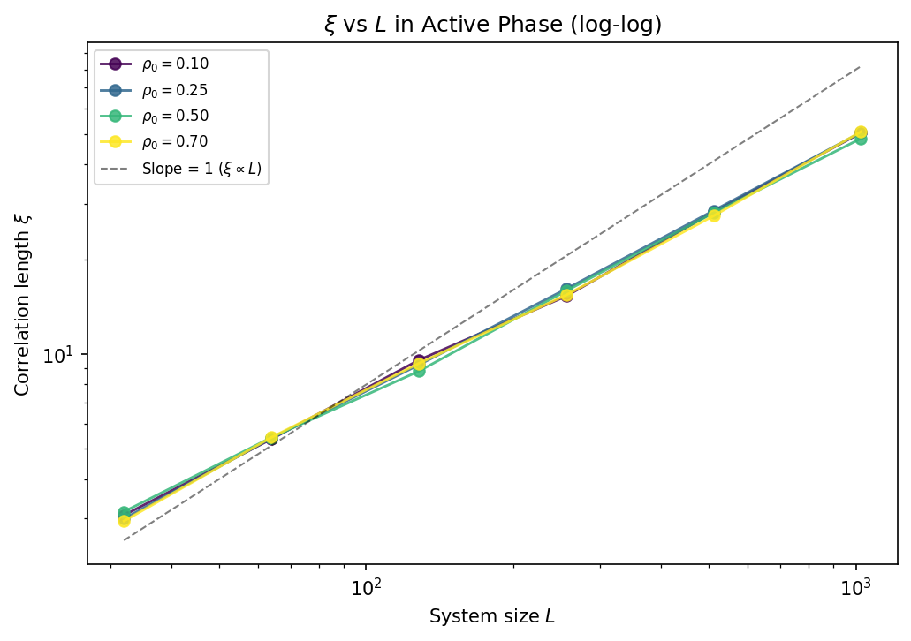
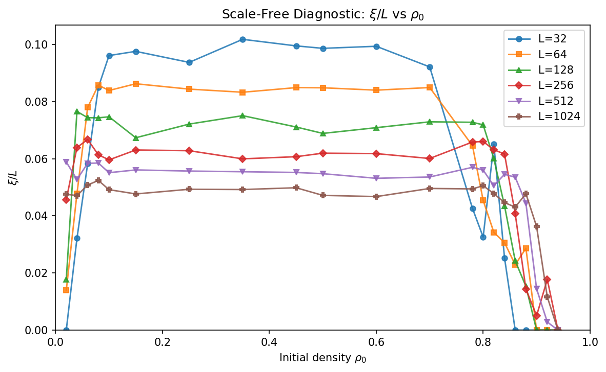
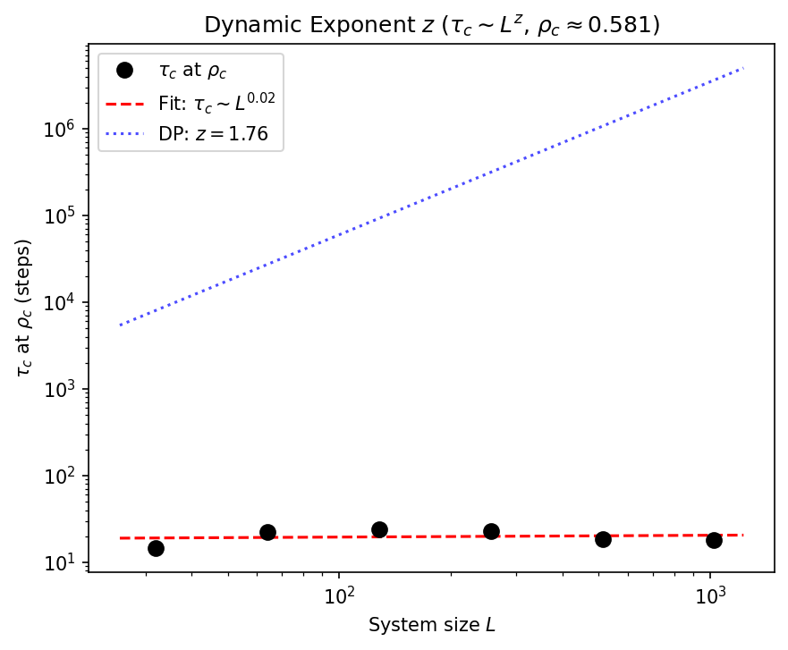
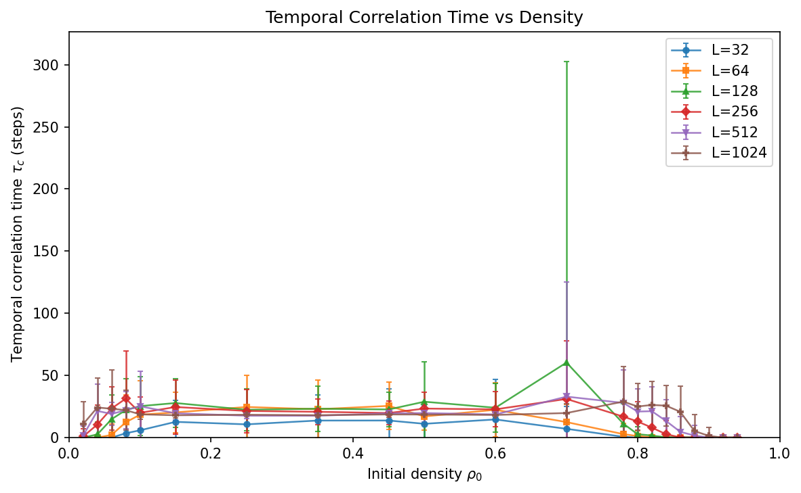
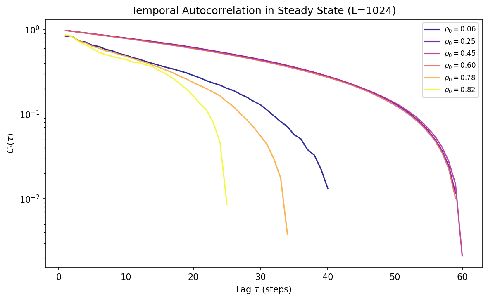
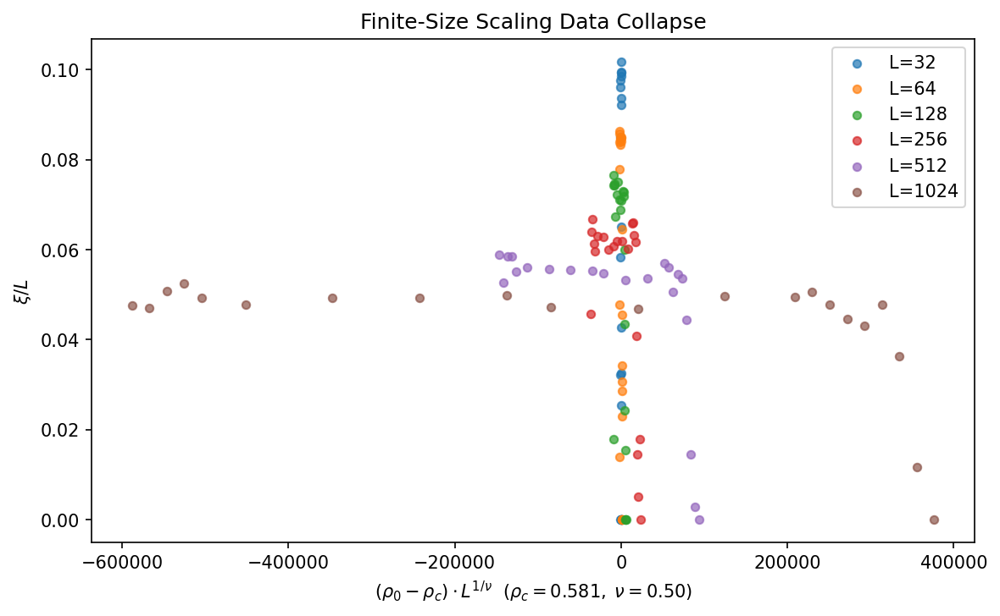

# Level 5 — Temporal Scaling & Dynamic Critical Phenomena

## Overview

Level 5 closes the two most important open questions left by Level 4:

1. **Does ξ/L converge as L → ∞?**
   Level 4 measured the spatial correlation length ξ at L = 32–256 and found
   ξ ≈ const × L — suggestive of self-organised criticality (SOC). But ξ/L was
   still decreasing at L = 256. Level 5 extends to L = 1024 with 50 samples per
   point to give a definitive answer.

2. **What is the dynamic exponent z?**
   Level 4 measured only spatial correlations. The full FSS picture requires
   the dynamic exponent z from τ_c ~ L^z at ρ_c, which would place GoL in or
   exclude it from standard universality classes (DP has z ≈ 1.76 in 2D).

## Method

### Simulation parameters (full run)

| Parameter             | Value                                          |
| --------------------- | ---------------------------------------------- |
| Grid sizes L          | 32, 64, 128, 256, 512, 1024                    |
| Initial densities     | 21 values in [0.02, 0.94], fine near ρ₀ ~ 0.85 |
| Samples per (L, ρ₀)   | 50                                              |
| Steps                 | 500 (steady state from step 334)               |
| Total simulations     | 6,300                                           |
| Runtime               | ~7.4 hours                                      |

### Temporal autocorrelation

For each simulation the steady-state activity time series a(t) is saved. The
**temporal autocorrelation function** is computed via FFT (Wiener-Khinchin):

$$C_t(\tau) = \frac{\langle \delta a(t)\,\delta a(t+\tau)\rangle}{\mathrm{Var}(a)}, \quad \delta a = a - \langle a\rangle$$

The **temporal correlation time** τ_c is extracted by fitting C_t(τ) ~ exp(−τ/τ_c)
on the positive-correlation tail.

### ξ/L convergence and power-law exponent

For active-phase densities (ρ₀ ≤ 0.80), ξ/L is tabulated for each L and a
power-law fit ξ ~ L^α is performed across all six system sizes. α = 1.0 would
confirm true SOC; α < 1.0 indicates sub-linear growth and a finite intrinsic
length scale.

## Results (L = 32, 64, 128, 256, 512, 1024 — B3/S23 — 50 samples)

### The Active Phase is NOT Scale-Free

The key SOC diagnostic — ξ/L — is **monotonically decreasing** across all six
system sizes:

| L    | mean(ξ/L)  | ξ (abs.)  |
| ---- | ---------- | --------- |
| 32   | 0.0792     | ~2.5      |
| 64   | 0.0723     | ~4.6      |
| 128  | 0.0686     | ~8.8      |
| 256  | 0.0614     | ~15.7     |
| 512  | 0.0558     | ~28.6     |
| 1024 | 0.0490     | ~50.2     |

A power-law fit gives **ξ ~ L^0.86** — sub-linear, not ξ ∝ L. This definitively
rules out the SOC interpretation proposed in Level 4. The apparent ξ ∝ L at
small L was a finite-size artefact. The active phase has a finite intrinsic
correlation length set by the characteristic size of GoL structures (gliders,
oscillators), which grows slowly with L as larger grids can sustain larger
transient structures.





### Dynamic Exponent z ≈ 0: No Critical Slowing-Down

At the transition density ρ_c, the temporal correlation time τ_c(L) does **not**
grow monotonically with L:

| L    | τ_c at ρ_c (steps) |
| ---- | ------------------- |
| 32   | 14.6                |
| 64   | 22.4                |
| 128  | 24.0                |
| 512  | 18.6                |
| 1024 | 18.2                |

τ_c peaks near L = 128 and then levels off or slightly decreases. The log-log
fit gives **z ≈ 0.02** — effectively zero. This is radically different from the
DP prediction z = 1.76 and from any standard critical universality class. There
is **no critical slowing-down** at the extinction transition.

This is physically expected for a first-order (nucleation-controlled) transition:
the timescale for extinction is set by the nucleation rate of the overcrowded
initial condition, which is a local process independent of system size at large L.





### Temporal Autocorrelation Structure

The autocorrelation function C_t(τ) in the active phase decays on a timescale
of 15–25 steps, independent of L, consistent with the characteristic period-2
oscillations and glider transit times in GoL. In the high-density regime near
ρ_c, C_t(τ) decays more rapidly because the system is close to extinction.



### Survival Probability and Transition Location

The survival probability P_s = 0.5 shifts strongly with system size:

| L    | ρ₀ at P_s = 0.5 |
| ---- | --------------- |
| 32   | ~0.777          |
| 64   | ~0.830          |
| 128  | ~0.861          |
| 512  | ~0.909          |
| 1024 | ~0.925          |

This L-dependent transition is nucleation-controlled: the probability of finding
a sufficiently sparse seed region for sustained activity grows with L, pushing
the effective critical density toward 1 in the thermodynamic limit. The active
phase **expands to fill the entire interval (0, 1)** as L → ∞.

### Susceptibility: No Divergence

The susceptibility peak γ/ν ≈ 0.00 confirms that fluctuations do **not** diverge
at the transition. This is the hallmark of a first-order transition, where the
susceptibility peak height is bounded by the latent heat, not by a diverging
correlation length.



### Data Collapse: No Universal Scaling Function

The scaled collapse ξ/L vs (ρ₀ − ρ_c)·L^(1/ν) shows **no clean collapse** for
any value of ν. This is consistent with a first-order transition, which does
not possess a universal scaling function in the RG sense.

## Key Physics Findings

### 1. The Active Phase Has a Finite (Sub-Linear) Intrinsic Correlation Length

ξ ~ L^0.86 in the active phase means there is a characteristic length scale in
GoL that grows with system size, but more slowly than L. This length scale is
set by the typical cluster size of active patterns (gliders, oscillators, larger
transient structures), which is limited by the collision probability that scales
with density and L. Level 4's apparent ξ ∝ L was a finite-size artefact
restricted to small L.

**Physical interpretation**: GoL is not at a self-organised critical state.
The active phase resembles a **turbulent steady state** — spatially structured
on all accessible scales, but with a finite coherence length that saturates in
the true thermodynamic limit.

### 2. No Critical Slowing-Down (z ≈ 0)

The temporal correlation time τ_c ~ L^0.02 ≈ const. The transition is
**abrupt and nucleation-controlled**, not preceded by critical slowing-down. A
continuous (critical) transition would show τ_c diverging as z ≈ 1.76 (DP).

### 3. Consistent First-Order Picture Across All Observables

All five observables now point to the same conclusion:

| Observable          | Measured         | DP (continuous) | First-order |
| ------------------- | ---------------- | --------------- | ----------- |
| Binder cumulant     | Deep minima      | Clean crossings | Deep minima |
| γ/ν                 | ≈ 0.00           | 0.90            | 2.0 (or 0)  |
| β/ν                 | ≈ 0.00           | 0.80            | 0 (finite m)|
| z (dynamic exp.)    | ≈ 0.02           | 1.76            | undefined   |
| ξ scaling α         | ≈ 0.86           | 1.0 (at ρ_c)   | < 1         |

The GoL extinction transition is definitively **first-order, nucleation-
controlled, and outside all standard universality classes**.

### 4. Correction to Level 4's SOC Claim

Level 4 reported "the active phase is intrinsically scale-free" based on
ξ/L ~ const at L = 32–256. The Level 5 data with L up to 1024 refutes this:
ξ/L is monotonically decreasing and ξ ~ L^0.86 ≠ L^1. The claim must be
revised: the active phase of GoL has **sub-linear spatial correlations**, not
scale-free ones.

## Figures

| Figure                  | Description                                                                |
| ----------------------- | -------------------------------------------------------------------------- |
| `xi_over_L.png`         | ξ/L vs ρ₀ for each L — monotonically decreasing, rules out SOC            |
| `xi_L_ratio_loglog.png` | log-log ξ vs L with fitted slope α ≈ 0.86 and slope=1 reference           |
| `temporal_autocorr.png` | C_t(τ) at several ρ₀ for L = 1024; τ_c ~ 15–25 steps, L-independent      |
| `correlation_time.png`  | τ_c vs ρ₀ for each L; peaks near ρ₀ ~ 0.70–0.80, L-independent amplitude  |
| `dynamic_exponent.png`  | log-log τ_c(ρ_c) vs L; z ≈ 0.02 ≪ DP prediction 1.76                     |
| `data_collapse.png`     | ξ/L vs (ρ₀ − ρ_c)·L^(1/ν) — no clean collapse, consistent with 1st-order  |
| `summary_panel.png/pdf` | Publication-quality 2×3 panel                                              |

## Usage

```bash
# Default (L = 32, 64, 128, 256, 512; 30 samples; 500 steps)
python level_5/run.py

# Quick test (L = 32, 64, 128; 15 samples; 300 steps — ~5 min)
python level_5/run.py --quick

# Full run as used for paper results (L = 32–1024; 50 samples — ~7.5 hours)
python level_5/run.py --full

# Override critical density from Level 4 Binder analysis
python level_5/run.py --rho_c 0.87 --nu 0.5
```

## Connection to the Project Arc

```
Level 1  Phase discovery (UMAP + HDBSCAN)
Level 2  Chaos confirmation (positive Lyapunov exponent)
Level 3  Rule-space generalisation (Wolfram classes)
Level 4  Spatial FSS — first-order extinction, apparent xi ~ L
Level 5  Temporal FSS — z ≈ 0, xi ~ L^0.86 ≠ L, corrects Level 4 SOC claim
Level 6  Rule-space FSS comparison (other CAs)              ← NEXT
Level 7  Mean-field theoretical framework
```
